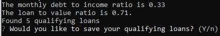
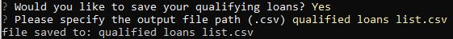
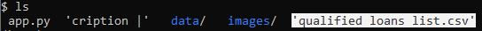

# Module 2 Challenge

In this project, the active CLI has been updated to give users the ability to save their qualified loans to a .csv file. 
Users are now able to decide on the file name and which directory they wish to save to.

With loan information saved, users can adjust the entered income, credit scores, ect. and compare the qualified loan results with other past results.

---

## Technologies

This project uses Python 3.9.7 and the following libraries - 
| Library | Version | Documentation
|----|----|---|
| Fire |0.4.0| [Fire docs](https://python-fire.readthedocs.io/en/v0.4.0/)
| Questionary |1.10.0| [Questionary docs](https://questionary.readthedocs.io/en/stable/index.html)


---

## Installation Guide

Libraries can be installed with the following commands
```
pip install fire

pip install questionary
```


---

## Usage

To use the loan qualifier CLI, clone the repo and run the app.py file
```
python app.py
```
The file path for the rate sheet is - <span style="color:yellow">data/daily_rate_sheet.csv</span>

*After providing the required loan information, the CLI will ask if the results are to be saved.*



*Once the user selects yes(Y) the file path and name can be determined.
The user is then given confirmation that the file was saved*



*The ls command will show the new file in the proper directory*




---

## Contributors

Dan McQueen

dandmcqueen@gmail.com

[Linkedin](https://www.linkedin.com/in/dan-mcqueen-4a5980238/)


---

## License

[GNU v3.0](GNU_License.txt)


